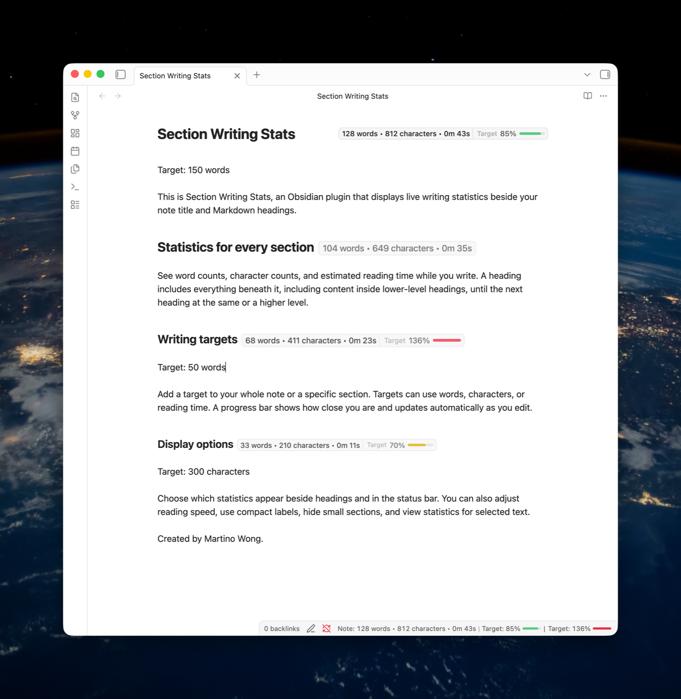

# Section Writing Stats

Live word counts, character counts, reading time, and writing-target progress for every section of an Obsidian note.

Section Writing Stats places a small, continuously updated badge beside the note title and each Markdown heading. It helps you check the length of a chapter, scene, article section, or complete note without interrupting your writing.

[Install from Obsidian Community Plugins](https://community.obsidian.md/plugins/section-meter) · [View the latest release](https://github.com/martinowong/obsidian-section-meter/releases/latest)



## At a glance

- See live statistics beside headings, in the note title or in the status bar
- Track words, characters, and estimated reading time.
- Add writing targets (words, characters, or reading time) for the whole note or an individual section.
- Customize which statistics and labels are displayed.

## How sections are counted

A section begins at a heading and ends immediately before the next heading of the same or a higher level.

Parent headings include their nested subsections. In this example, **Chapter one** includes the introduction and both scenes, while each scene badge counts only that scene:

```md
# Chapter one

Introduction...

## First scene

Scene text...

## Second scene

More text...
```

This follows the structure of the Markdown document, so lower-level headings remain part of the section above them.

## Writing targets

The easiest way to manage a target is through the command palette. Place the cursor in the relevant section and run one of these commands:

- **Set or edit whole-note writing target**
- **Set or edit current-section writing target**
- **Remove whole-note writing target**
- **Remove current-section writing target**

Choose words, characters, or reading time in the target dialog. Existing targets are filled in automatically when you edit them.

### Targets in Markdown

Targets are stored as ordinary `Target:` lines, so they remain visible and portable with the note. A whole-note target goes before the first heading, after YAML frontmatter if the note has any:

```md
Target: 1200 words

# My draft

Start writing here...
```

A section target goes beneath its heading:

```md
# Introduction

Target: 250 words

Introduction text...

## Background

Target: 1800 characters

Background text...
```

Supported formats include:

- `Target: 250 words`
- `Target: 1800 characters`
- `Target: 3 min`
- `Target: 3m`
- `Target: 2m 30s`

Target lines are excluded from the statistics. A parent target covers the complete parent section, including nested headings. A nested section can define its own target, which takes priority while the cursor is inside that section.

Progress bars update while you write. They change colour as the target approaches, turn green when it is reached, and turn red after the configured overage threshold.

## What is counted

Section Writing Stats is designed to measure readable prose rather than Markdown syntax.

It counts text in paragraphs, lists, blockquotes, links, and table cells. It excludes:

- YAML frontmatter
- Fenced and inline code
- Embeds
- Comments and HTML
- Writing-target lines

Character counts can include or exclude spaces. Reading-time estimates use an adjustable words-per-minute setting.

## Display and settings

You can configure:

- Word count, character count, and reading-time visibility
- Heading badges, title badges, and status-bar statistics
- Compact labels and custom separators
- Count-based or percentage-based target labels
- Reading speed and character-count spacing
- The target overage warning threshold
- Whether empty or very short sections show badges
- Whole-note and selected-text status-bar statistics

## Limitations

- Statistics are shown in the editor, not Reading view.
- Counts are based on fast Markdown cleanup rather than Obsidian's complete renderer. Content produced by other plugins, rendered transclusions, and complex mathematics may differ slightly from what is visible on screen.

## Installation

Install **Section Writing Stats** from **Settings → Community plugins → Browse** in Obsidian, or open its [Community Plugins page](https://community.obsidian.md/plugins/section-meter).

### Manual installation

Download `main.js`, `manifest.json`, and `styles.css` from the [latest release](https://github.com/martinowong/obsidian-section-meter/releases/latest), then place them in:

```text
.obsidian/plugins/section-meter/
```

Restart Obsidian—or reload the installed plugins—and enable **Section Writing Stats** under **Community plugins**.

## Development

```sh
npm install
npm test
npm run lint
npm run build
```

For local testing, copy or symlink the repository into `.obsidian/plugins/section-meter`, build the plugin, and enable it in Obsidian.

## License

Section Writing Stats is available under the [MIT License](LICENSE).

Created by [Martino Wong](https://github.com/martinowong) with AI tools. This is an independent community plugin and is not affiliated with, endorsed by, or sponsored by Obsidian.
